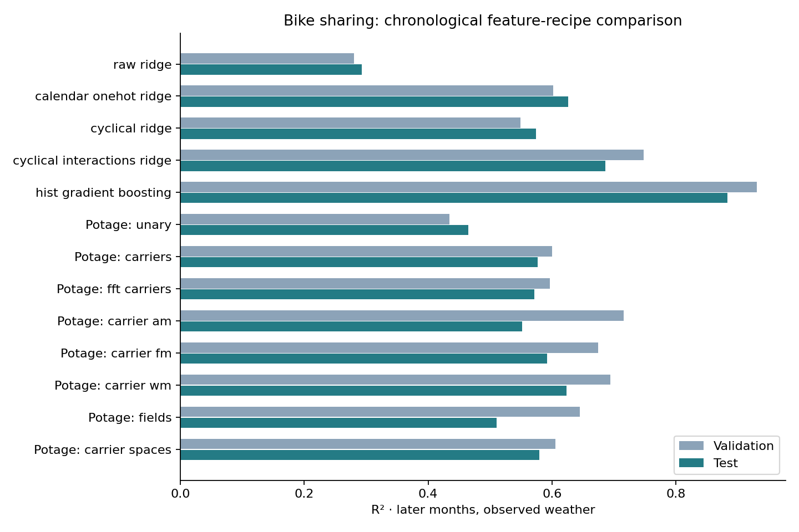

# Bike sharing: automatic features on later months

Potage improves on raw ridge in this chronological comparison, but does not
beat manually engineered cyclical interactions or histogram gradient boosting.
The Potage recipe chosen on validation uses carriers followed by AM: test
R² **0.552**, versus **0.293** for raw ridge, **0.686** for manual cyclical
interactions, and **0.883** for boosting. Its validation R² was 0.716, showing
that choosing among useful candidate features can still overfit a time period.

The selected time-of-day and hour–weather expressions are consistent with
known demand patterns. This illustrates automatic discovery of useful,
domain-relevant features: fewer combinations need to be specified by hand,
and the resulting expressions remain inspectable. The available transform
families still encode modeling assumptions, and predictive usefulness does
not establish a causal mechanism.

Potage assists exploration; it does not replace domain expertise. The stronger
manually engineered baseline makes that distinction concrete. This is not a
state-of-the-art claim or a rerun of the old random-split bike-sharing research.



## Data and chronological protocol

Use the hourly file from Hadi Fanaee-T's
[UCI Bike Sharing dataset](https://doi.org/10.24432/C5W894), licensed CC BY 4.0.
The downloaded `hour.csv` contains **17,379 rows** from 2011–2012. The script
pins the archive SHA-256 and records the hourly-file hash in its output.
It preserves every hourly observation; unlike the older research preprocessing,
it does not merge identical predictor rows or average their targets.

| Split | Dates (inclusive) | Rows | Role |
|---|---|---:|---|
| Training | 2011-01-01 to 2012-06-30 | 13,003 | Fit transforms, feature references, scalers, and readouts |
| Validation | 2012-07-01 to 2012-09-30 | 2,208 | Select features, ridge strength, and the Potage recipe |
| Test | 2012-10-01 to 2012-12-31 | 2,168 | Final reporting after choices are frozen |

The inputs are season, year, month, hour, holiday, weekday, working-day flag,
weather category, temperature, apparent temperature, humidity, and wind speed.
`casual` and `registered` are components of the target `cnt` and are excluded.
Row ID is excluded; dates are used only to order and split observations.

This is prediction of later hourly counts using their **observed weather**.
It does not simulate advance forecasting with weather forecasts, demand lags,
or a rolling model update. Train, validation, and test share no dates.

## Baselines and feature recipes

All ridge models standardize their input columns using training statistics.
Their penalty is selected from the same 15 logarithmically spaced values,
0.001 through 10,000, by validation RMSE. Negative predictions are left
unchanged for all ridge models. Models are not refitted on validation rows.

- **Raw ridge:** the twelve numeric-coded inputs. This deliberately simple
  baseline does not handle calendar categories appropriately by itself.
- **Calendar one-hot ridge:** one-hot calendar/weather categories plus the four
  continuous weather variables. Levels are learned on training rows.
- **Manual cyclical ridge:** hour harmonics 1–4 with period 24, month harmonics
  1–2 with period 12, and weekday harmonics 1–2 with period 7; other categories
  are one-hot encoded and continuous weather variables are retained.
- **Manual cyclical interactions:** additionally multiply hour harmonics by
  working-day status and temperature. This is an explicit domain-engineered
  alternative to automatic composition.
- **Histogram boosting:** 300 iterations, L2 penalty 1, random seed 42, default
  remaining tree settings, and no random internal early-stopping split.

Potage uses greedy selection with explicit chronological validation. Season
and weather category are categorical; binary flags stay Boolean; hour, month,
and weekday are numeric coordinates available to carrier transforms. Recipes
start from up to 16 selected unary features, then compose the stages below,
keeping at most 24 final columns. Unary-only selection also has a cap of 24.

| Recipe | Composition |
|---|---|
| Unary | Raw and unary transforms |
| Carriers | Selected unary features + static carriers |
| FFT carriers | Selected unary features + target-guided frequencies |
| Carriers + AM | Within-set AM on 12 selected carriers, fused with unary/carrier features |
| Carriers + FM | Eight carriers modulated by eight unary features |
| Carriers + WM | Eight carriers window-modulated by eight unary features |
| Fields | Two-dimensional local zones from eight unary features |
| Carrier spaces | Linear, signed-log, and tanh coordinate spaces |

The fixed carrier grid is `[1, 2, 3, 4]` with phase scale `2π`; modulation grids
and budgets are recorded in the [script](bike_sharing.py). Potage carriers use
training-range normalization. Unlike the manual baseline's exact calendar
periods, a frequency value here need not represent an exact 24-hour cycle.
The field recipe uses three percentile levels and two zone radii. Recipes cap
estimated candidates at 40,000 and estimated memory at 2 GB; these are guards,
not measured process-memory limits.

## Results

| Model | Features | Validation R² | Test R² | Test MAE (rentals/hour) |
|---|---:|---:|---:|---:|
| Raw ridge | 12 | 0.280 | 0.293 | 129.29 |
| Calendar one-hot + ridge | 61 | 0.602 | 0.626 | 90.40 |
| Manual cyclical encoding + ridge | 34 | 0.549 | 0.575 | 94.70 |
| Manual cyclical interactions + ridge | 50 | 0.748 | 0.686 | 84.09 |
| Histogram gradient boosting | 12 | 0.931 | 0.883 | 44.54 |
| Potage unary | 14 | 0.435 | 0.465 | 113.92 |
| Potage carriers | 22 | 0.600 | 0.577 | 97.35 |
| Potage FFT carriers | 24 | 0.596 | 0.572 | 97.64 |
| Potage carriers + AM **(validation choice)** | 24 | 0.716 | 0.552 | 103.29 |
| Potage carriers + FM | 24 | 0.674 | 0.593 | 95.20 |
| Potage carriers + WM | 24 | 0.695 | 0.624 | 89.22 |
| Potage fields | 24 | 0.645 | 0.511 | 109.76 |
| Potage carrier spaces | 24 | 0.605 | 0.579 | 97.26 |

The recipe and penalty choices were frozen on validation before computing test
scores. A second execution reproduced every validation metric and selected
feature list exactly before reporting the test quarter. Histogram boosting
was the best overall validation choice as well as the best test result.

WM has the highest test R² among the Potage recipes, but **was not selected by
validation**. Picking it after seeing this table would be a new tuning decision
requiring another independent evaluation. The selected AM recipe loses much of
its validation advantage on the later quarter.

Simple carriers illustrate the convenience tradeoff: 22 automatically selected
columns lift test R² from 0.293 to 0.577, while calendar one-hot ridge uses 61
columns and reaches 0.626. Handcrafted cyclical interactions do better still.
Different temporal windows could change these comparisons.

## Correctness checks and the field fix

This run exposed a field-stage defect: constant-candidate filtering used the
current validation/replay batch rather than the training reference. That could
change the candidate schema or erase an indicator that was constant one in a
small batch. The field builder now decides candidate eligibility from training
rows; regression tests cover both schema agreement and single-row replay.
The bike results include this fix, released in v0.1.1.

For all eight Potage recipes, training replay matches the fitted feature
matrix, and the first 24 validation predictions agree when evaluated together
or individually (maximum absolute discrepancy below 2e-13 rentals). The selected
recipe also passes that check on the first 24 test rows. These are targeted
correctness checks, not a guarantee covering every possible input.

Replay can emit zero-fill warnings for one-hot categories absent from a batch;
the corresponding indicator is correctly zero. The saved numerical results
include the batch-agreement measurements and raw-column ancestry.

## Reproduce

After the [repository setup](../README.md), run a quick validation-only example:

```bash
python examples/bike_sharing.py --recipes carriers --output artifacts/bike_carriers.json
```

The first run downloads the small UCI archive; later runs use `.cache/`.
NumPy, SciPy, and scikit-learn are sufficient unless plotting is requested.
Use v0.1.1 or newer, which includes this example and the field fix.

To inspect all recipes without scoring the final quarter:

```bash
python examples/bike_sharing.py --output artifacts/bike_validation.json
```

To reproduce the saved comparison with settings fixed beforehand:

```bash
python -m pip install -e '.[examples]'
python examples/bike_sharing.py --evaluate-test \
  --output artifacts/bike_results.json --plot artifacts/bike_results.png
```

Once test scores have been inspected, further tuning against them is exploratory.
This is one temporal window with shared data and validation-guided feature
selection, not independent replications or a statistical significance claim.
The earlier 0.64–0.68 random-split results used different preprocessing and
additional recipes/routing, and are not directly comparable.

[Full metrics, selected features, stage counts, versions, and hashes](bike_sharing_results.json)
