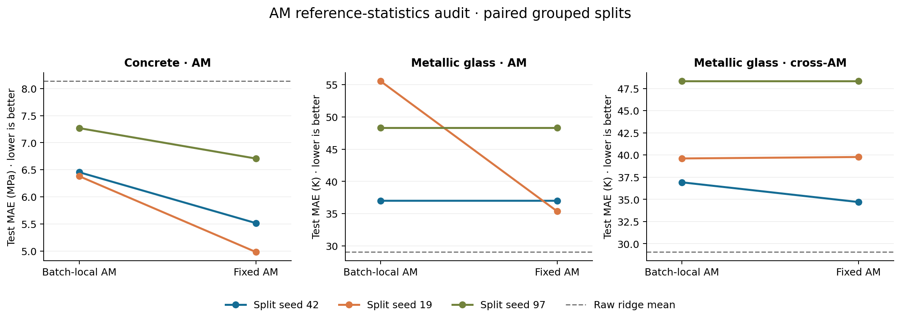

# AM replay: paired research audit

The AM defect materially affected some research results. In three grouped concrete splits, mean test R² increased from **0.514 to 0.797**, while mean MAE decreased from **6.70 to 5.74 MPa**. Metallic-glass effects varied by split and selected feature family. Correct replay is necessary for reproducible predictions; it does not guarantee a better statistical model.



## Comparison protocol

This is an **AM-only ablation**, not old-package versus new-package benchmarking. Both arms use the current library, including corrected rank handling, OMP scoring, deduplication, and feature ordering. The legacy arm restores batch-local AM statistics; the fixed arm uses training references and clips power exponents to the training range. Selection is rerun in each arm against the same validation split. An additional replay-only comparison freezes each fitted feature set and readout, then swaps the replay mode.

The legacy emulation was checked against both original AM builder functions from a local pre-fix snapshot. Their outputs matched exactly by name on training data, a holdout batch, a single row, and a batch containing a constant column (eight comparisons). Cross-set training standard deviations were already passed in the old implementation and remain intact in the emulation. The JSON records the archived function hashes and comparison results.

Data and split seeds were fixed before inspecting outcomes: **42, 19, 97** for the outer split, with seed + 1 for validation. Concrete uses all 1,030 rows and groups identical seven-ingredient recipes (428 groups). Metallic glass uses the existing 843-row, 81-descriptor research table, grouping identical descriptor rows (841 groups). Approximately 60/20/20 of groups go to discovery/validation/test. All groups are disjoint within each split.

Concrete follows the existing unary → AM → greedy selection recipe with 20 output features and the same RidgeCV readout. Metallic glass is a focused descriptor → raw selection → AM → ridge diagnostic: 10 raw features, 20 final features, and a ratio cap of two. Its cross-AM variant uses overlapping top-10 and top-8 raw pools, matching that construction in the historical soup probe. They are **not** disjoint Magpie/MEGNet views. Rank and reciprocal families are excluded for glass, as in the research probe.

## All split results

| Experiment | Seed | Legacy R² | Fixed R² | Legacy MAE | Fixed MAE | Raw ridge MAE |
|---|---:|---:|---:|---:|---:|---:|
| Concrete AM (MPa) | 42 | 0.458 | 0.812 | 6.45 | 5.52 | 7.50 |
| Concrete AM (MPa) | 19 | 0.368 | 0.826 | 6.38 | 4.98 | 7.96 |
| Concrete AM (MPa) | 97 | 0.716 | 0.753 | 7.27 | 6.71 | 8.95 |
| Metallic glass AM (K) | 42 | 0.933 | 0.933 | 37.01 | 37.01 | 29.83 |
| Metallic glass AM (K) | 19 | 0.843 | 0.924 | 55.55 | 35.38 | 26.36 |
| Metallic glass AM (K) | 97 | 0.868 | 0.868 | 48.33 | 48.33 | 31.03 |
| Metallic glass cross-AM (K) | 42 | 0.932 | 0.937 | 36.92 | 34.70 | 29.83 |
| Metallic glass cross-AM (K) | 19 | 0.909 | 0.909 | 39.61 | 39.78 | 26.36 |
| Metallic glass cross-AM (K) | 97 | 0.868 | 0.868 | 48.33 | 48.33 | 31.03 |


## What changed

- **Concrete improves on all three splits.** On the existing seed-42 split, AM alone changes test R² from 0.458 to 0.812. The previously reported 0.418 → 0.812 comparison bundled other fixes; 0.458 is the appropriate legacy value for this isolated AM comparison. Selected-feature overlap is only 47–64% by Jaccard similarity, so the defect influenced validation-based discovery as well as final prediction.
- **Metallic glass provides a clean replay-only example.** On seed 19, the single-AM arms select the same features and fit the same readout. Correcting replay alone changes MAE from 55.55 K to 35.38 K and R² from 0.843 to 0.924. Seed 97 selects no affected AM families and is unchanged.
- **Cross-AM impact is mixed.** Mean glass MAE changes from 41.62 K to 40.94 K. Seed 19 is slightly worse after correction (39.61 K → 39.78 K); correctness does not promise a metric improvement on every split.
- **The glass recipe still loses to raw ridge on every split.** Raw ridge averages 29.07 K MAE, versus 40.24 K for corrected single-AM and 40.94 K for corrected cross-AM. This audit does not establish that Potage helps this particular configuration.

## Batch dependence and controls

For each fitted arm, the first 16 test rows were predicted both in the full test batch and in isolation/in a 16-row batch. The legacy concrete prediction changed by up to **100.82 MPa** for the same row. On glass, a cross-AM prediction changed by **208.20 K** when evaluated in the smaller batch. This is a software defect, independently of whether a particular test score happens to increase or decrease.

Corrected predictions differed by at most **1.14e-13 target units** across these checks. In nine negative-control fits, excluding `am_ratio`, `am_logratio`, and `am_power` yielded identical selected features and predictions between modes. The audit script asserts both controls. Most game probes already exclude all three families, making them less informative for isolating this AM issue; their other historical results have not been revalidated here.

## Interpretation and limits

Earlier claims that a bad AM score necessarily showed feature overfitting or unstable physical relationships need reassessment when the selected pipeline contained affected families. The bug could alter both which expressions were chosen and their measured generalization. Fixing replay after fitting helps some models, but rerunning discovery is preferable because the validation features may also have been wrong.

This is a diagnostic audit on already available research data, not a fresh independent confirmation. The three test splits overlap across seeds; means are descriptive, not independent replicates or significance tests. It does not rerun the historical metallic-glass neural cascade, enriched Magpie/MEGNet features, or multi-pass residual experiment, and it does not update their headline scores. Grouping identical descriptors is not a leave-chemistry-family-out evaluation. RidgeCV retains the original readout's internal validation behavior; only outer discovery/validation/test boundaries are explicitly grouped. Training-reference reuse and bounded power exponents are tested together, not separately.

## Reproduce

```bash
pip install -e '.[examples]'
python research/am-replay-audit/audit.py \
  --concrete-data-home .cache \
  --metallic-glass-csv /path/to/signalfault/data/metallic-glass/features.csv \
  --output artifacts/am_replay_audit.json \
  --plot artifacts/am_replay_audit.png
```

Omit `--metallic-glass-csv` for the standalone concrete audit. Concrete uses the same OpenML cache as the existing benchmark; metallic-glass data is read locally and is not copied into Potage. The experiment-only legacy context patches builder bindings inside its Python process and must not be used concurrently or in production.

[Audit code](audit.py) · [Full results, features, hashes, and replay diagnostics](results.json)
